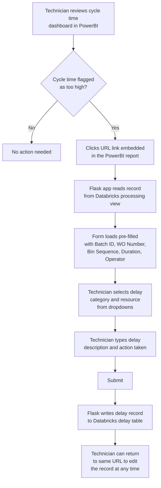
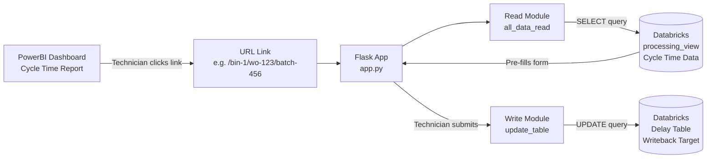

# Delay CRUD App
### Writeback Tool for Technicians on Cycle Time Data

A lightweight Flask web application that allows technicians to log and edit delay reasons directly against cycle time records stored in Databricks. Records are pre-filled from a URL link — no manual data entry required to identify the lot.

---

## The Problem

In manufacturing and processing environments, cycle time data is monitored in **PowerBI**. When a lot's cycle time is flagged as too high, there is often no easy way for technicians on the floor to record *why* the delay happened without going through a separate system or emailing someone.

This app closes that gap.

---

## How It Works

### User Flow



---

### Architecture



---

### URL Structure

Records are accessed via a structured URL. This URL can be embedded directly in PowerBI reports as a clickable link on any flagged cycle time row:

```
/batch_id/<batch_id>/bin_sequence/<bin_sequence>/wo_number/<wo_number>
```

**Example:**
```
/batch_id/batch-456/bin_sequence/1/wo_number/wo-123
```

When a technician visits this URL, the form is automatically populated with all known data for that record — they only need to fill in the delay details.

---

### The Form

The form presents:

| Field | Type | Editable |
|---|---|---|
| Batch ID | Text | Read-only |
| Work Order Number | Text | Read-only |
| Bin Sequence | Text | Read-only |
| Bin Start Time | Text | Read-only |
| Processing Duration | Text | Read-only |
| Operator | Text | Read-only |
| Sample Lot | Text | Read-only |
| Delay Category | Dropdown | ✅ |
| Delay Step | Dropdown | ✅ |
| Resource | Dropdown | ✅ |
| Equipment ID | Text | ✅ |
| Delay Description | Text area | ✅ |
| Action Taken | Text area | ✅ |

Read-only fields are pulled from the cycle time source table. Editable fields are written to the delay table on submit.

---

## Tech Stack

| Layer | Technology |
|---|---|
| Web Framework | Python / Flask |
| Database | Databricks SQL |
| Data Layer | Databricks SQL Connector |
| Data Processing | Pandas |
| Frontend | Jinja2 HTML Templates |
| Deployment Config | app.yaml |

---

## Project Structure

```
CRUDFlaskApp/
├── app.py                          # Flask routes
├── app.yaml                        # Deployment config / env vars
├── requirements.txt
├── templates/
│   ├── add_delay.html              # Main delay entry form
│   └── update_submitted.html       # Confirmation page
└── lib/
    └── modules/
        ├── sql/
        │   └── main.py             # Databricks connection class
        ├── all_data_read/
        │   ├── main.py             # Read module
        │   └── _query_delay_info.sql
        └── update_table/
            ├── main.py             # Write module
            └── _query_update_table.sql
```

---

## Configuration

Set the following environment variables before running:

```bash
export DATABRICKS_SERVER_HOSTNAME="your-workspace.cloud.databricks.com"
export DATABRICKS_HTTP_PATH="/sql/1.0/warehouses/your-warehouse-id"
export DATABRICKS_ACCESS_TOKEN="enter-your-databricks-token"
```

Or configure them in `app.yaml` for container-based deployment.

---

## Running Locally

```bash
pip install -r requirements.txt
python app.py
```
